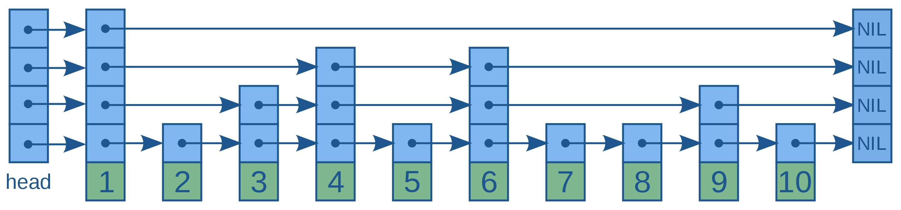

---

<pre>
________ ______________ 
___  __ \_/  ___/___  / 
__  /_/  /____ \ __  /  
_  _, _/ ____/ / _  /___
/_/ |_|  /____/  /_____/ 
Randomized Skip List
</pre>

A [**Randomized Skip List**](https://en.wikipedia.org/wiki/Skip_list) is a data structure that allows Finding / Insertion / Deletion in $\mathcal{O}(\log n)$ on average. Therefore, it is a good alternative to [AVL Trees](https://en.wikipedia.org/wiki/AVL_tree).

     
    <em>An example instance of a skip list.</em>

---

### SkipList

The standart SkipList.

| Method        | Description   |
|------------------------------|---------------|
| fn new() -> SkipList&lt;T&gt; | Creates a new (empty) SkipList  |
| fn insert(&mut self, val: T) | Inserts a new element into the SkipList |
| fn insert_or_replace(&mut self, val: T) -> Option<Rc&lt;T&gt;>| Same as insert but additionally removes and retrieves a similar node if exists |
| fn find(&self, val: &T) -> Option<Rc&lt;T&gt;> | Search the value into the SkipList. Returns a pointer of the value if it exists |
| fn find_node(&self, val: &T) -> Option<Rc<Node&lt;T&gt;>> | Same as find but returns the Node that contains the searched value |
| fn delete(&mut self, val: &T) -> Option<Rc&lt;T&gt;> | Deletes the value from the SkipList. Returns it if it exists |
| fn remove(&mut self, node: &Rc<Node&lt;T&gt;>) | Removes a node from the SkipList, given Node must be part of the SkipList |
| fn iter(&self) -> NodeIterator&lt;T&gt; | Creates an iterator that iterates over all elements in SkipList in sorted order |

### Node

Internal representation of a value, including pointers to pre- / successors.

| Method        | Description   |
|------------------------------|---------------|
| fn pre(&self) -> Option<Rc<Node&lt;T&gt;>> | Returns a pointer to the predecessor node (if available) |
| fn suc(&self) -> Option<Rc<Node&lt;T&gt;>> | Returns a pointer to the successor node (if available) |
| fn val(&self) -> Rc&lt;T&gt; | Returns a pointer to the value inside the Node |

---

### SkipMap

A Map data structure based on a SkipList.

 Method        | Description   |
|------------------------------|---------------|
| fn put<'a>(&mut self, key: &K, value: V) -> Option<Rc&lt;V&gt;> | Puts a key with associated value into the SkipMap, returns old value if it exists |
| fn get(&self, key: &K) -> Option<Rc&lt;V&gt;> | Returns value associated to key if it exists |
| fn del(&mut self, key: &K) -> Option<Rc&lt;V&gt;> | Deletes value with associated key, returns deleted value if it exists |
| pub fn find(&self, key: &K) -> Option<Rc<Node<Entry<K, V>>>> | Finds node that holds the entry. |
| fn iter(&self) -> MapIterator<K, V> | Iterator over all entries, each given as an SEntry |

### SEntry

Struct that holds a key with its associated value.

Accessible fields of SEntry<K,V>:
 - key: K
 - value: Rc&lt;V&gt;

### Entry

Internal struct used for mapping.